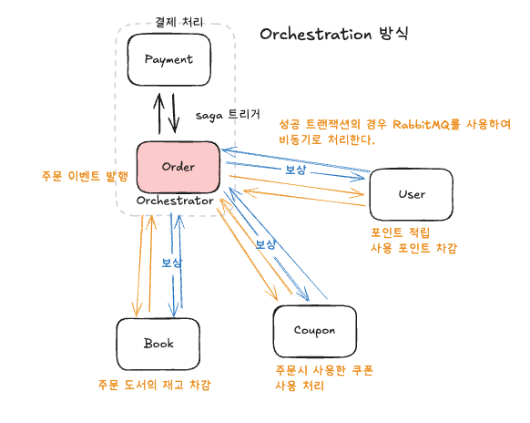
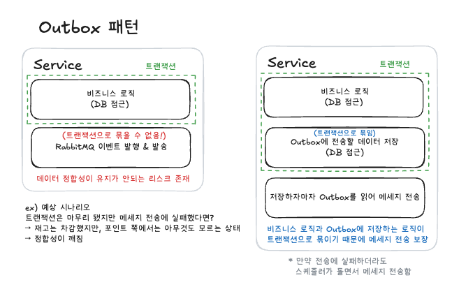
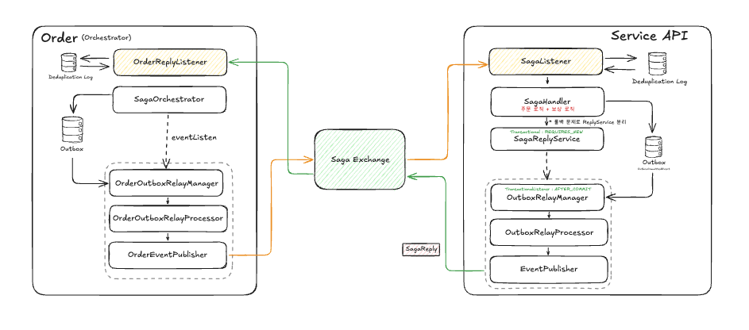

# 📖 daiso book shop
- daiso book shop은 사용자가 책을 조회하고 주문할 수 있는 사이트입니다.
- 스프링 기술과 데이터베이스를 활용한 인터넷 도서 쇼핑몰 프로젝트입니다.
- URL: https://www.daiso-book.shop

### 개발 기간
- 2025.11.11 ~ 2025.12.31

### 구성원
| <a href="https://github.com/0xDF0101"> 김유진</a> | <a href="https://github.com/hetgwi01"> 김동건</a> | <a href="https://github.com/jin000oo"> 양진영</a> | <a href="https://github.com/kimbokyung282"> 김보경</a> |<a href ="https://github.com/leehanum">  이한음</a>|<a href ="https://github.com/R4mel">  한인혁</a>|<a href ="https://github.com/shinjunsik">  신준식</a>|
|-----|-----|-----|-----|-----|-----|-----|

### 개발 환경
- 개발도구: Intellij IDEA - Ultimate
- 언어: Java 21 LTS 
- 빌드도구: Maven
- 개발
    - Spring Framework: 6.2.12
    - Spring Boot: 3.5.7
    - Spring Cloud
        - Spring Cloud Gateway
        - Spring Cloud Netflix (Eureka)
        - Spring Cloud Config
        - Spring Cloud OpenFeign
    - Spring Data
        - Spring Data JPA
        - Spring Data Elasticsearch
        - Spring Data Redis
    - JPA
        - QueryDSL
    - Connection Pool
        - Apache Commons DBCP2
- 테스트
    - Junit5
    - AssertJ
    - Mockito
    - SonarQube
- 데이터베이스
    - MySQL: 8.0.41
    - Redis
- 검색엔진
    - Elasticsearch: 8.19.3
- ERD
    - ERDCloud
- Message Queue
    - RabbitMQ
- 협업 도구
    - GitHub projects
    - 브랜치 전략 : Git Flow

---

## 사용 기술

### 언어

### Framework

 

 

### Build Tool

### DataBase

### CI/CD

### DevOps

### ETC

 

 

### Front

---

## 아키텍쳐 구조

 

### CI/CD

 

### ERD

 

## Project Management
> Github 제공하는 `Projects`를 활용하여 프로젝트 일정 관리 \
> `notion`을 활용하여 회의록 및 문서, 이슈 관리

### Scrum

- 시간
    - 매일 09:30 Scrum Meeting 진행
- 회의 내용
    - 금일 Scrum Meeting까지 진행한 내용
    - 다음 Scrum Meeting까지 진행할 내용
    - 진행하면서 어려웠던 사항
    - 필요한 회의사항

### 일정관리
- github RoadMap 활용으로 전체적인 일정 진행상황 관리
- 요구사항을 이슈로 작성해 역할을 분담한 후 일정 관리

- github Kanban 활용으로 실시간 진행 상황 관리

- 각자 현황을 실시간으로 업데이트하여 팀원들과 공유

# 기능
## 김유진
### 주문, 장바구니 (Order & Cart)
- MSA 환경에서 분산 트랜잭션을 Saga 패턴으로 해결 
- CRUD가 빈번한 장바구니 로직에서 Redis를 통한 캐싱 처리 

### Redis를 이용한 장바구니 캐싱 처리 (Write-Back 방식)
  - 우선적으로 Redis에 장바구니 데이터를 저장하고, 이후 한꺼번에 DB 동기화
  - Dirty Flag 전략을 사용해서 변경 사항에 대해서만 DB 동기화 실행
    - 장바구니에 변경 사항 발생 시 해당 항목에 Dirty Flag 세움
    - 스케줄러가 주기적으로 `dirty:true`가 붙은 장바구니 키만 조회해서 DB에 일괄 저장
    - Redis 전체를 확인하지 않고 변경 사항에 대해서만 Sync함
### 분산 트랜잭션 문제를 해결하기 위한 Saga 패턴 도입

- **Saga(Orchestration 방식)**

  - **성공 매커니즘**
    - `Order API` 가 Orchestrator가 되어 주문 Saga의 모든 흐름과 상태를 관리함
    - 각 서비스에 이벤트를 전송하고, 응답을 받음
    - 성공 응답이 반환될 경우, 상태를 업데이트하고 다음 서비스에 이벤트 전송
    - 마지막 서비스로부터 성공 응답을 받을 경우 주문 Saga 종료
  - **실패 매커니즘**
    - 특정 서비스에서 비즈니스 오류 발생 (ex. 재고 부족), 자체적으로 롤백 후 `Order API`에게 실패 메세지 전송
    - `Order API`가 비즈니스 오류가 발생한 서비스로부터 실패 메세지를 수신받음
    - 보상 이벤트를 발행하고 그 이전 서비스부터 순차적으로 보상 트랜잭션을 시작함

### (추가) 정합성과 멱등성 보장을 위한 Outbox 패턴과 Deduplication Log 도입
- **Outbox 패턴**

  1. 비즈니스 로직 이후 바로 전송되는 것이 아니라 Outbox 테이블에 저장(save)됨
    - 비즈니스 로직과 Outbox에 저장되는 로직은 한 트랜잭션으로 묶이게 됨
  2. Outbox에 저장된 이후 (트랜잭션이 커밋된 이후) 즉시 Outbox 테이블을 읽어 전송되지 않은 메세지를 전송함
  3. 만약 전송 실패 시, 스케줄러에 의해 전송되지 않은 메세지를 전송함
  4. 적어도 한번 (`At-least-once delivery`) 전송됨을 보장
- (추가) **멱등성 보장**을 위한 `Deduplication Log`의 도입
  - Outbox는 '적어도 한번 전송'은 보장하지만 '두번 이상 전송'이 발생할 가능성을 가지고 있음
  - 요청이 두번 전송되게 되면 로직이 두번 수행되는 **멱등성 위반**이 발생함
  - 이것을 방지하기 위해 각 서비스별로 `Deduplication Log` 테이블을 두고, 요청마다 Log를 기록하여 중복 요청시 무시하도록 함

## 김동건
### 도서

### 카테고리

### 태그

### 좋아요

### 리뷰

## 양진영
### 회원 (User & Account)
- MSA 환경에서의 안전한 인증/인가 및 회원 생애주기 관리 담당

#### 회원 가입
- BCrypt 알고리즘을 활용한 비밀번호 암호화 및 개인정보 마스킹 처리
- SMTP(JavaMailSender) + Redis를 활용한 이메일 인증
  - 회원가입
  - 아이디 / 비밀번호 찾기
  - 휴면 계정 해제
- Redis TTL 기반 인증 번호 관리로 보안성 및 만료 처리 자동화

#### 마이페이지 · 배송지 관리
- 회원 정보 수정, 비밀번호 변경, 회원 탈퇴(Soft Delete) 기능 구현
- 배송지 관리 CRUD 및 기본 배송지 설정 로직 구현
  - `@Modifying`을 활용한 기본 배송지 일괄 업데이트 최적화

#### 포인트 · 등급 시스템
- 전략 패턴(Strategy Pattern)을 적용한 포인트 적립 / 사용 정책 관리
- 포인트 이력(History) 추적 및 상태 관리
- 회원 등급(Grade) 스키마 설계 및 등급 변경 이력 관리

#### 관리자 기능 · 성능 최적화
- QueryDSL 기반 동적 쿼리 구현
  - 다중 조건 검색
  - 페이징 처리 및 성능 최적화
- JPA Fetch Join / `@EntityGraph` 설정을 통한 N+1 문제 해결

#### 테스트 및 품질 관리
- JUnit5, Mockito 기반 Unit / Integration Test 작성
- SonarQube 기준 테스트 커버리지 70% 이상 달성

## 김보경
### 결제

- 토스페이먼츠 기반 결제 승인/취소/환불 및 결제 이력 관리 담당

### 토스 결제 위젯 연동
- 결제 페이지에서 Toss 결제 위젯 호출 및 결제 정보 바인딩
- 쿠키(Access Token) 유무로 회원/비회원 결제 분기 처리

### 결제 승인
- 주문 총액과 결제 요청 금액 검증으로 위/변조 방지
- 멱등성 보장

### 결제 취소/부분 취소/ 환불
- 취소 금액 미입력 시 전액 취소, 입력 시 부분 취소 처리

### 결제 이력 관리
- 주문 단위 결제 이력 조회 API 제공
    - 회원 요청 시 본인 주문 접근 권한 검증

## 이한음
### 쿠폰

- 관리자 쿠폰 관리
    - 쿠폰 정책 관리 페이지 구현
    - 쿠폰 정책 등록, 수정, 삭제 기능 구현
- 생일 쿠폰 발급
    - spring scheduler 매월 1일 쿠폰 발급
    - spring batch로 대용량 데이터 처리
- 회원가입시 웰컴 쿠폰 발급(비동기 처리)
- 마이페이지 쿠폰 조회
    - 사용 가능한 쿠폰
    - 이미 사용한 쿠폰
    - 만료된 쿠폰
- 특정 도서/카테고리 쿠폰 구현
    - 도서 상세 페이지에서 카테고리/도서 쿠폰 다운로드 구현
- 주문시 쿠폰 적용 구현
    - 도서 별 쿠폰 적용 가능 여부 확인
    - 도서 별 쿠폰 적용
    

### 인프라

## 한인혁
### 인증/인가

- JWT (JSON Web Token) 기반 보안 아키텍처 구축
    - Access Token 및 Refresh Token 발급, 검증, 만료(Rotation) 로직 구현
    - RTR (Refresh Token Rotation) 전략 적용: 보안 강화를 위해 토큰 갱신 시 Refresh Token도 함께 재발급
    - Redis 기반 토큰 관리: Refresh Token 저장(TTL 설정) 및 로그아웃 시 Access Token 블랙리스트(Blacklist) 처리로 무효화 구현
- Spring Security & OAuth2 연동 (PAYCO)
    - Stateless 보안 구성: SessionCreationPolicy.STATELESS 정책 적용 및 CSRF 비활성화, CORS 설정
    - PAYCO 로그인/회원가입 구현: Authorization Code Grant 방식을 활용한 OAuth2 인증 흐름 제어
    - 보안 강화: Redis를 활용한 State 파라미터 검증으로 CSRF(Cross-Site Request Forgery) 공격 방지
- MSA 간 통신 및 예외 처리
    - OpenFeign 연동: UserServiceClient를 통해 User Service와 통신하며 회원 가입 및 로그인 처리
    - Global Exception Handling: GlobalExceptionHandler를 통해 인증 실패, 계정 상태(휴면/탈퇴) 등 다양한 예외 상황에 대한 표준화된 응답 처리

### CI/CD 및 인프라 (DevOps)
- GitHub Actions 기반 CI/CD 파이프라인 구축
    - Maven 빌드, Docker Image 생성 및 Docker Hub 푸시 자동화
    - SonarQube 연동: 정적 코드 분석 및 테스트 커버리지(95% 이상) 품질 게이트(Quality Gate) 적용
- Docker Compose 기반 고가용성(HA) 배포
    - Rolling Update 구현: 쉘 스크립트를 통해 다중 컨테이너(team3-auth-1, team3-auth-2)를 순차적으로 재시작하여 무중단 배포 구현
    - Health Check 도입: Spring Boot Actuator Health Check를 통해 컨테이너가 정상 구동(UP)된 후 트래픽을 전환하도록 배포 안정성 확보

## 신준식
### 검색 (Search)
- Elasticsearch 기반 도서 검색 및 추천 시스템 개발 담당

### 도서 검색 기능 구현
- 도서명, 저자명, 출판사명, 카테고리 등을 기반으로 검색
- Elasticsearch를 활용한 고성능 검색 기능 제공
- 벡터 검색을 통한 유사 도서 검색 기능 구현
- 검색 결과에 대한 페이징 처리 및 정렬 기능 구현
- Redis를 활용한 AI 검색 결과 캐싱 및 성능 최적화

### AI를 활용한 도서 추천 시스템 개발
- Ollama API를 활용한 벡터 생성 및 유사도 측정 (bge-m3 모델 사용)
  - 도서명, 저자명, 출판사명 등의 메타데이터 기반 벡터 생성
  - 사용자 검색어와 도서 벡터 간의 유사도 측정
- Reranker API를 활용한 개인 맞춤형 도서 추천 기능 구현
  - 검색결과 향상 및 사용자 경험 개선
  - 책과 검색어 간의 연관도 측정
- llm 모델과의 연동을 통한 추천 정확도 향상 (gemini api 2.5 flash 사용)
  - 사용자가 입력한 검색어 기반으로 관련 도서 추천
  - 추천 도서에 대한 간단한 설명 제공

### 데이터베이스와 Elasticsearch 연동
- MySQL과 Elasticsearch 간의 데이터 동기화 전략 수립
  - RabbitMQ를 활용한 실시간 데이터 동기화
  - MySQL 데이터 변경 시 Elasticsearch 자동 업데이트
- Scheduler를 활용한 활성화된 할인율 정보 동기화
  - 활성화된 할인율 정보를 주기적으로 Redis에 동기화하여 성능 최적화
  - Elasticsearch와 MySQL 간의 할인율 정보 일관성 유지

### 도서 카테고리 (Category)
- 도서 카테고리 관리 및 계층 구조 구현
- 카테고리 단계 구조 설계

### 도서 데이터 파싱 및 적재
- 외부 API를 활용해 부족한 도서 데이터 수집 및 파싱
- 수집된 도서를 MySQL과 Elasticsearch에 적재
  - 도서에 대한 벡터 정보 생성 및 Elasticsearch에 저장
  - MySQL과 Elasticsearch 간의 데이터 일관성 유지

### 테스트 및 성능 최적화
- JUnit5와 Mockito를 활용한 단위 테스트 및 통합 테스트 작성
- SonarQube를 활용한 코드 품질 관리 및 테스트 커버리지 (80% 이상) 달성

## 팀원 공통
- 데이터베이스 설계 및 ERD Diagram 작성

